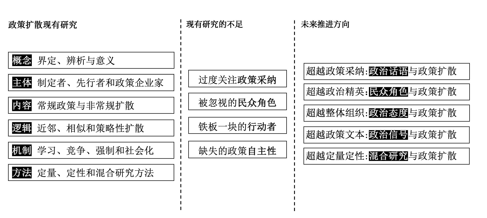
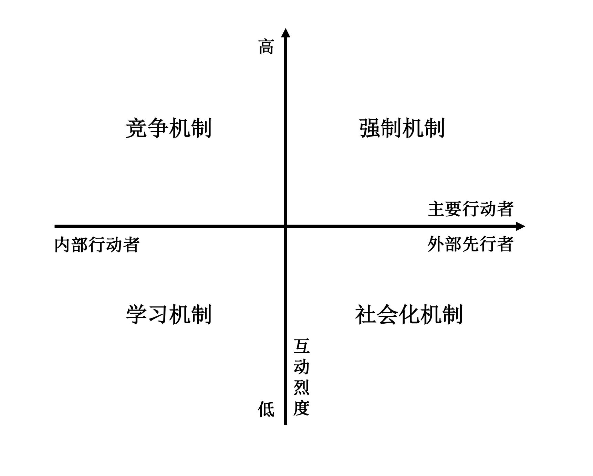

---
output:
  bookdown::pdf_document2:
    keep_tex: true
    fig_caption: true
    latex_engine: xelatex
    number_sections: true
  bookdown::word_document2:
    reference_docx: "template_CHN.docx"
    keep_md: true
    number_sections: FALSE
knit: (function(inputFile, encoding) {rmarkdown::render(inputFile, encoding = encoding, output_format = c("bookdown::word_document2", "bookdown::pdf_document2")) })
documentclass: ctexart

always_allow_html: true

fontsize: 12pt
geometry: margin=1in
bibliography: DoctoralQualificationExamination.bib
csl: "china-national-standard-gb-t-7714-2015-author-date.csl"
link-citations: true
colorlinks: true
toc: true
indent: true

editor_options: 
  markdown: 
    wrap: sentence

title: '政策扩散研究评述：理论、方法和进路'

author:
- 孙宇飞 2020312236^[清华大学政治学系2020级直博生，联系电话：18638750921，邮箱：sunyf20@mails.tsinghua.edu.cn]

---

\newpage

# 引言

当一个政治行为体进行政策制定时，会受到其他行为体既有政策的影响，这一过程通常被称为“政策扩散”。
作为政治话语的重要组成部分，公共政策是政治学重要的研究领域和数据来源，政策扩散是描述和解释公共政策传播的核心概念。
“政策扩散”是一个包括社会政策、经济政策、政治政策等各个政策领域的政策传播过程；是一个政府组织、政治精英、政策企业家、新闻媒体和民众等各个政治主体的政治互动过程；它贯穿从议程设置、到政策采纳、再到政策执行和反馈的政策全过程。
理解**哪些**政策**如何**、**为何**在不同政治**主体**间互动，最终实现在不同政府间传播这一现象，是理解政治参与、政府间关系、民主运行、政治文化等政治学核心议题的重要窗口。

政策扩散作为公共政策研究的核心议题，受到学界的持续关注。
从 @Walker1969 的开创性研究以来，顶级政治科学期刊发表了数百篇关于政策扩散的文章。
政治科学研究者们借助事件史分析、主题模型、社会网络分析等方法从不同视角研究了政策如何在不同政治实体之间传播。
从美国国内政治出发，政策扩散这一概念还被其他众多学科所接纳，激发了比较政治、国际关系、公共政策等领域的大量研究。

本文旨在通过梳理政策扩散的现有研究，讨论了政策扩散是什么、扩散什么、谁扩散、为什么扩散、怎么扩散、怎么研究扩散等问题，以识别和评估当前学术界的主要贡献和遗漏。
笔者发现
现有文献从多主体、跨领域、全过程出发，对政策扩散进行了深入和研究。
但仍存在对政策采纳的过分关注、对民众的忽视、对内部行动者自主性的忽视等问题和遗漏。
政策扩散领域还存在着广阔的学术推进空间。
在此基础上，本文从“政治话语”、“民众角色”、“政治态度”、“政治系统”等角度出发，提出了政策扩散研究未来可能的发展方向。
图 <a href="#fig:frame">1</a> 是本文的分析框架。

{width=90%}

\newpage

# 政策扩散的概念：界定、辨析与意义

政策扩散，作为政治科学中经典的研究领域，从描述美国国内政治开始，被公共行政、比较政治、国际关系等各个学科的学者接受和使用。
本节从政策扩散的概念界定出发，将政策扩散与政策传播中的近邻概念进行比较和辨析，在此基础上论述了政策扩散概念的意义和价值。

## 概念界定

一个政治实体（地方、国家、国际组织等）采取的政策不仅会受到内部因素影响，还会受到外部行动者政策影响。[@GilardiEtAl2021]。
政治学和公共管理等学科领域对政策扩散的研究方兴未艾。
同时，随着研究的不断深入和研究重点的转换，政策扩散的概念也在不断变化（见表 <a href="#tab:definition">1</a>）。
现有对政策扩散的定义可以从“政策创新”、“政策过程”、“政策结果”和“全球化”四个视角进行理解。

<table class="table" style="margin-left: auto; margin-right: auto;">
<caption>Table 1: 政策扩散的经典定义</caption>
 <thead>
  <tr>
   <th style="text-align:center;"> 文献 </th>
   <th style="text-align:center;"> 概念界定 </th>
  </tr>
 </thead>
<tbody>
  <tr>
   <td style="text-align:center;"> Lucas, 1983 </td>
   <td style="text-align:center;width: 30em; "> 创新项目或方案从其发源地流向其他区城或组织之中，被当地决策者采纳并进入政策执行流程的过程。 </td>
  </tr>
  <tr>
   <td style="text-align:center;"> Rogers, 1995 </td>
   <td style="text-align:center;width: 30em; "> 在特定的时间内,通过特定学习渠道，在特定社群中进行传播交流的过程 </td>
  </tr>
  <tr>
   <td style="text-align:center;"> Simmons, 2004 </td>
   <td style="text-align:center;width: 30em; "> 一个国家政策选择影响其他国家政策选择的过程。 </td>
  </tr>
  <tr>
   <td style="text-align:center;"> Evans, 2009 </td>
   <td style="text-align:center;width: 30em; "> 某个部门或层级的政策知识被应用到其他部门或层级治理的发展过程。 </td>
  </tr>
  <tr>
   <td style="text-align:center;"> Shipan, 2012 </td>
   <td style="text-align:center;width: 30em; "> 一个政府受到其他政府选择影响，将外来的政策经验、信息与理念吸纳到本土政策的过程。 </td>
  </tr>
</tbody>
</table>

**政策创新视角。**
政策扩散的早期研究基于政策创新理论展开[@BaoWeiHui2021]。
因此，这一阶段的政策扩散概念，和政策创新一体两面，紧密相连。
政策创新是指政府在本地制定一项从未制定过的新政策，无论这个政策或项目是否原创[@Walker1969]。
如果这个政策有被其他政府制定过，无论被提出多长时间，只要被内部行动者吸纳，即为政策扩散。[@Rogers2003]
政策创新与扩散往往是一个连续且不可分割的过程。相比而言，政策创新研究侧重于解释政策采纳与否的瞬时状态及其原因，扩散研究则更重视阐明政策采纳的历时性动态机制。[@ZhangKe2015]

@Lucas1983 对政策扩散的定义虽然更加侧重于政策的执行而非首次出台，但是“创新”的特点仍十分突出。
他认为政策扩散是从首创者流向其他政府部门的现象，外来政策被当地政府首次接受并执行。
他还强调组织对于政策扩散的影响，他认为政策创新的扩散是在组织中传递的，又推动者组织的变革。
这一前瞻性的定义为之后注重政策过程和结果的政策扩散定义打下基础。

**政策过程视角。**对于政策创新的过分关注，会导致出现专注于采纳创新而忽视政策制定的其他环节，从而使我们无法更广阔得了解政策扩散过程[@GilardiEtAl2021 ; @Rogers2003 ; @Karch2007]。
随着政策扩散研究的进一步深入，学者们对政策扩散理解的着重点从“首次采纳”拓展至“政策过程”，更多地从内外部行动者之间的互动过程理解政策扩散。
在这一互动过程中，组织对政策扩散的影响尤为重要。
@Rogers2003 将政策扩散从首次采纳，定义为“互动-采纳-治理”的政策过程中的全过程扩散。
进一步的，@GilardiEtAl2021 从问题定义和议程设置视角定义政策扩散，将政策扩散的研究再次拓展到政策制定的整个过程。

**政策结果视角。**对如何扩散的过度关注是政策扩散研究受到的主要批评之一。
作为对这一批评的回应，学者们开始从结果角度理解政策扩散。
这一方面的研究主要包括政策趋同（Policy Convergence）和政策再造（Policy Reinvention）两个方面。
@Berry1994 将政策扩散的过程定义为在不同的地理空间，某一方面的政策的相似性增加。
@Inkeles2019 认为政策扩散是政府政策从不同的位置，人为的变化到某些同一位置的过程。
除了政策趋同之外，学者们还从政策扩散的差异结果研究政策扩散，并提出政策再造的概念[@Clark1985]。
政策扩散并不一定会导致不同部门政策的完全相同，内部行动者也不是完全被动的接受政策扩散，他们会根据自身的实际情况对政策进行批判性接受[@GlickHays1991; @Hays1996; @MooneyLee1995; @ZhangHaiZhuLinHuaJing2021]。
还有学者从政策执行的角度关注政策扩散，认为政策扩散是指某一政府部门的政策影响到其他政府部门的治理过程。[@Evans2009]

**全球化的视角。**
虽然政策扩散的概念起始于美国国内政治研究[@Walker1969]，但是受到比较政治学和国际关系领域学者的关注和接纳，[@Milner1998]他们将政策扩散从美国国内政治领域拓展到跨国政治和国际政治层面。
和国内政治相比，国际关系学者更加关注社会化过程和身份政治如何影响规范在国际社会的传播，
他们注重考察国际组织在促进各国实现相似政策方面的作用。
尽管这些概念与美国地方政治有关，但在国内政策扩散的研究中并未深入探讨。[@Checkel1999]

根据上述梳理，我们可以发现，**政策扩散概念经历了一个从“单维”到“多维”的演变过程。**
从政策扩散的主体来看，从政府拓展到包括国际组织、社团等在内的各类政治主体；
从政策扩散的过程来看，从单一的政策首次接纳，扩展到“议程设置-政策采纳-政策执行-政策结果”的整个过程；
从政策扩散的内容来看，政策扩散从单一的国内成文政策扩展到全球政策和规范；
从研究领域来看，政策扩散最早由美国国内政治的研究者提出后，迅速的被比较政治学、国际关系等领域的学者接受和借用。

## 近邻概念辨析

作为政治科学研究重要的研究对象和数据来源，公共政策研究在政治学中有着悠久的传统。
政策传播作为公共政策研究的核心议题，受到学界的持续关注。
学者们多元的研究视角制造出诸如“政策扩散”、“政策转移”、“政策趋同”、“政策再造”等概念，来描述和解释“政策从一个政府传递到另一个政府”这一现象[@ShipanVolden2012]，在丰富研究视野的同时，也会导致人们对政策扩散概念理解的模糊。[@ZhuXuFengZhangYouLang2014]
这些概念的的内涵、关注重点、研究进路等特点各异，但也存在着联系，在政策传播领域的知识积累上相互补充。
厘清政策扩散和政策传播其他近邻概念的联系和差别，有助于我们进一步理解政策扩散概念的内涵和特点。

**从经典定义上来看，“政策扩散”、“政策转移”、“政策趋同”、“政策再造”都是对政策传播现象的描述。**
“政策扩散”是指一项政策创新通过某种做法或实践，经过空间或时间的过程在政治系统成员中传播交流的过程。“扩散是一种交流新观念的交流”[@Rogers2003; @STRANG1991]。
“政策转移”是指存在于某一时间与空间的政策安排被用于另一时间和空间的政策设计[@Bennett1991]，和它相似的概念还包括，吸取教训（Lesson Drawing）和政策模仿（Policy Emulation）。
“政策趋同”是指在社会发展的相似条件下，政策在组织结构、过程和运行方面的相似性[@Knill2005]。这些相似主要包括政策目标、政策内容、政策工具、政策结果和政策风格五个方面的趋同[@HolzingerKnill2005]。
“政策再造”是指政策文本随着政策扩散的进程而变化和重新设计[@GlickHays1991]，一些政策的整合性会随着传播而扩大[@Hays1996]，另一些政策会由于其本身的特点而被其他政府修改[@Volden2006]。

**“政策扩散”、“政策趋同”、“政策转移”和“政策再造”既有联系，又有本质差别。**
首先，从关注重点上，这些概念各自侧重描述不同的政策传播的不同重点。
“政策扩散”早期的研究更多关注的是政策传播的条件，即回答“政策传播”何以发生？学者从时间、空间和条件等方面的相似性上给出解释；
“政策转移”是指侧重于政策转播的过程，它将政策从一个部门传播到另一个部门视作一个互动的阶段，而非“传染”的结果[@BensonJordan2011]；
但无论是“政策扩散”还是“政策转移”都关心的是政策制定过程中的传播，而忽视了这种传播的影响和结果。[@Ladi2011]
面对这些批评，学者提出了“政策趋同”和“政策再造”来描述和解释政策传播的结果，
“政策趋同”描述的是政策传播后的相似趋势，原始政策某项政策的某个或多个特征，在一段时间内发展为更多政治实体的相似性。[@Berry1994]
这一概念本身就是结果性而不是过程性的，它不像政策扩散和政策转移那样强调政策跟随者的主动性。
“政策再造”弥补了政策扩散对政策内容缺乏关注的不足，主张政策再造的学者认为，政策传播不是复制的过程，政策传播的内部行动者的主动性会使得他们对政策传播产生抵制或修改的能动行为，创造出新的政策。[@GlickHays1991; @MooneyLee1995; @ZhangHaiZhuLinHuaJing2021]

其次，从基本类型上，
“政策扩散”领域的研究用“全国互动型”、“区域扩散型”[@HeichelEtAl2005]、“领导-跟进型”[@GrahamEtAl2008]和“垂直影响型”[@Heinze2011]对现有的政策扩散进行分类。
这一分类标准体现出对扩散条件明显的关注，无论是“全国互动型”的官员交流、“区域扩散型”的地理近邻、“领导-跟进型”的“政策绩效”，还是“垂直影响型”的中央动力都侧重回答“政策传播”何以发生这一问题。
“政策转移”从原始政策对内部行动者的影响程度出发，将政策转移区分为“复制”、“效仿”、“混合”和“启发”四种类型，带有明显的过程色彩[@DolowitzMarsh2000]。
“$σ$-趋同、$β$-趋同、$γ$-趋同和$δ$-趋同”是学者根据不同政治实体间的政策距离进行的类别划分，体现对政策传播结果的重视。
虽然政策再造还未有典型的类型划分，但是现有拒绝型和修改型均体现出内部行动者在政策传播结果上的能动性。

## 政策扩散概念的意义

虽然都是描述和解释政策传播的过程，但是自 @Walker1969 提出政策扩散的概念以来，政策扩散研究就爆发且持续的增长。相比之下，政策传播中的其他概念的研究便没有受到太多的关注。本文亦着重研究政策扩散，笔者认为和政策传播领域的其他概念相比，政策扩散研究有如下意义：

**概念全局性。**虽然早期的政策扩散研究注重于扩散条件的研究，但近年来，政策扩散研究扩散到了“政策文本”[@Hinkle2015; @LiJian2017]、“政策行动者”[@ZhuYaPengXiaoDiWen2014]、“政策扩散条件”[@DingMingJieZhangLiang2014]、“政策扩散机制”[@DingMingJieZhangLiang2014]等整个政策传播的各个方面[@GrahamEtAl2013]，具有全局性的特征。随着研究的深入，“政策扩散”概念指的不仅仅是类似政策的地理聚类，它是包含政府相互竞争、相互学习的整体政策传播过程。[@ShipanVolden2012]

**领域整合性。**正是由于政策扩散概念的全局性，其对政策传播中的其他概念也有着重要的整合功能，“政策转移”可以被视作“政策扩散”的过程，“政策扩散”的结果可以较好地由“政策趋同”和“政策再造概括”。

**研究综合性。**政策扩散的全局性不仅体现在全政策过程，还体现在政策扩散研究的综合性，由于扩散政策和扩散主体性质的不同，政策扩散受到包括“比较政治”、“国内政治”、“国际关系”、“公共行政”等各领域研究者的普遍关注。比较政治对政策趋同关注，国际关系对社会化机制的重视，公共行政领域对组织机制的强调，都使得政策扩散研究在跨领域发展的同时又不是孤立存在而是相互促进的。[@ShipanVolden2012]

**视角立体性。**早期的政策扩散研究关注时间、地点近邻性对政策传播的影响。随着研究的深入，政策扩散的研究者开始不仅限于一时一地的扩散，而是将政策扩散研究视作一个兼具时效性和长期性的纵贯过程。一方面，政策扩散研究仍然持续关注单个政策在集中截面时间的政策扩散来深入研究其内在现象和逻辑；另一方面，纵观的面板的政策研究开始增加，帮助学者更好的了解政策扩散的条件和机制。与此同时，政策行为体空间分布的差异，将政策扩散研究的视域拓展到新的纬度[@Rincke2007]，从一个立体性的视角展现政策传播多维现实。

\newpage

# 政策扩散的主体：内部行动者、政策先行者和政策企业家

政策扩散虽然以政策的制定作为表现形式，但每一个政策都是由具有不同偏好、目标、能力等特点的人来选择和影响的。
行动者作为政策扩散研究的核心对象，受到了研究者们的持续关注。[@DouglasEtAl2015]

本节笔者将从“内部行动者”和“外部行动者”两个类别出发，对政策扩散的行动的相关研究进行综述。
内部行动者，即扩散发生地的政策制定者，他们的身份、偏好、目标、能力和政策环境各异，从而对政策扩散的过程和结果均有影响。
政策扩散作为一个受到外部影响的过程，外部行动者亦十分关键。原始的政策创新者作为政策扩散的使动者，是政策扩散过程中重要的外部行动者，对政策扩散的方向和形式具有着重要的影响；
除此之外，智库、媒体、民众、政府间组织等“政策企业家”也是政策扩散过程当中重要的外部行动者。

## 内部主体：政策制定者

**扩散发生地的政策制定者是政策扩散的内部行动者。**
@ShipanVolden2012 对政策扩散的定义[^政策扩散定义]突出体现了内部行动者对于我们理解政策扩散的核心作用。
根据政策扩散发生场域的不同，地方政府[@MertensEtAl2021]、不同政府部门[@LuFang2021]、主权国家[@Solingen2012]、国际组织[@Jakobi2012]等政治实体都可以成为政策扩散的内部行动者。
他们的偏好、目标、能力、政策环境和身份各异，因此受到其他政府影响的程度和做出的反应也有较大差别，从而对政策扩散的过程和结果具有直接的影响。
政策扩散不是一个被动接受的过程，内部行动者发挥着自己重要的影响。政策扩散开始于内部行动者的偏好，服务于其目标，受到其能力和政策环境的限制。新进的研究从一个更加微观的角度，即内部行动者的个人特征来考察它政策扩散的影响。

[^政策扩散定义]: @ShipanVolden2012 将政策扩散定义为“政府的政策选择受到其他政府选择的影响”，体现出在自身政策选择中受到其他政府政策影响的内部行动者是我们理解政策扩散过程的核心。

**政策扩散内部行动者的偏好，是政策扩散的起点。**他们的偏好主要包括个人偏好和外界影响的偏好。个人偏好受到其学历和个人经历[@HanWanQu2019]等因素的影响，外部影响主要包括受到民众[@Perez-ArmendarizCrow2010]、利益集团[@GarrettJansa2015]和其他政府的影响。

**内部行动者的偏好是由他们的目标塑造的。**
一般来说，作为政治人物，内部行动者的目标主要包括政治目标和治理目标两个方面。政治目标主要包括晋升、连任和提升合法性等。内部行动者需要借鉴政策先行者的成功政策来显得更加有威望[@FordhamAsal2007]或治理社会的能力[@IkenberryKupchan1990]。受到政治目标影响的内部行动者往往会有选择地从他人的经验中学习[@Gilardi2010b]。此时，意识形态而非政策效能是他们的主要考量，他们会更多地根据先前使用者的意识形态来考量是否学习[@GrossbackEtAl2004a]。
治理目标主要包括扩大税基、增加收入、提供公共产品等现实治理需要。  @Levi-Faur2003 通过比较拉丁美洲和欧洲的政策扩散，发现有更加充足经济条件的政治实体往往会将政策目标视为主要诉求。
不同类型的政府有着不同的政策扩散目标，中央集权体制国家的内部行动者对上级目标有着更高的优先级。@ZhuXuFengZhaoHui2016 发现和西方选举民主体制相比，中国地方政府在进行政策扩散时更加在意上级权威对自己政策扩散创新行为的认可。

**偏好和目标影响了政策扩散的方向，但内部行动者的能力决定着政策扩散能否按照方向实现。** 
@ShipanVolden2006 通过美国禁烟政策扩散的考察发现，内部行动者的立法能力影响着政策的垂直扩散是否达成。由于能力较低，那些“不太专业”州的立法机构表现出强大的“压力阀”效应，即最先改变政策的往往是最迫切的地方，但是当最迫切的地方政策实现创新后，上级政府感知到的压力就会减少，从而更少的进行政策扩散。
而在立法能力强的地方，更可能出现“滚雪球效应”，州立法者敏锐的发现到地方政策，并要求采纳，并将其扩展到全州，从而实现“民主实验室”的效果。
在后续的研究中， @ShipanVolden2008 通过考察禁烟政策在城市间采纳的异质性从自上而下和水平扩散两个层面进一步展现了地方政府能力对政策扩散的影响。地方能力强大的城市往往能够抵挡住中央政府政策压力，从而在政策扩散中具有更强的灵活性；地方能力弱小的城市往往会模仿中央或其他城市的政策，即使这些政策不适合他们自己的治理需要。

**内部行动者的能力会受到政策环境的限制**，@Weyland2005a 借助智利养老金私有化在拉丁美洲的扩散，发现时间和信息的有限影响着政策制定者的能力，从而影响着他们采纳学习、屈服于胁迫，或者根本不改变政策。 
@Stone1999 认为，面临经济危机或经历近期军事失败的政府更容易受到胁迫。  
@BaileyRom2004 发现，原本福利水平更高的政府在其再分配政策中比那些已经低福利水平的政府更能应对竞争压力。
选举环境对地方政府政策扩散选择而言是重要的影响因素，有选举或连任压力的政府的能力会被限制甚至降低其作出理性判断，从而对外界政策进行简单的模仿。[@Karch2007a]

**内部行动者的特点影响着政策扩散的方式和过程。**
例如，内部参与者的特征在政策以何种方式传播方面发挥着重要作用。
@Fuglister2012 发现是否具有政府间机构的成员资格与卫生政策的扩散效果十分相关。
@Milner2006 发现威权政府和民主政府相比更不太接受技术创新的传播。

**对于内部行动者来说，政策扩散并非单向被动接受的过程，而是一个主动选择的过程。**[@GlickHays1991]。无论是政策还是规范都可以通过明确拒绝或者偏差执行的方式进行应对。
内部行动者会根据其自身偏好与目标和外部行动者在政策上进行博弈，并根据其自身需要进行“政策再造”[@Hays1996]，以获得最有力的政策效果（政治上的或是治理上的）。
@LinXueFei2015 通过组织学习的视角理解政策再造的过程，发现“再生产”过程会在政策形式和政策执行两个层面背离政策原型。
不同政府同外部执行者博弈的空间并不相同，能力越强的政府对于政策修改的空间越大。

## 外部主体：政策先行者和政策企业家

**政策扩散的外部行动者主要包括政策先行者[^先行者]和“政策企业家”两大类。**
**在水平和垂直政策扩散中，政策先行者分别扮演着不同的角色。**

政策先行者是指已经采取了政策的行动者，他们可以是最早的政策创新者，也可以是上一次政策扩散的政策接受者。
对于水平扩散来说，这里的政策先行者是指政策扩散接受者的同级政府，他们的特点影响着内部参与者的政策扩散行为, 
@Pacheco2012a 发现外部行动者的性质、特点和随之而来的政治态度对于影响其他政府是否效仿政策十分重要。
例如，拥有更多专业知识的政府可能被视为领导者，他们的政策会更容易获得扩散，因为潜在的采纳者可能更有可能从大型或富裕政府的政策实践中学习。[@MaLiang2019]
有时，政策先行者的政策成功就取决于政策是否得到扩散（尤其是那些具有外部性的政策：如核能控制，环境保护，市场标准的扩散等）。因此政策先行者推动政策扩散的动机十分充足。
他们往往会采取主动行动促进政策扩散，面对政策接受者的不同反应，他们会用不同的方式进行主动互动。
如果面对竞争，他们会主动采取策略来使自己的原始政策更加有竞争力[@BaybeckEtAl2011]；
如果扩散对象采纳学习的方式，那政策先行者会借助这个机会进一步传播自己的政策标准和政策制定的理念[@Gilardi2010b]，从而在之后的政策过程中能够扮演更加重要的角色；
在社会化的过程中，他们更加有动机来增加主动传播，因为此时他们的政治抱负本身就取决于向他人展示其政策的成功[@Adler1992]

[^先行者]: 本文没有采纳常用的“其他政府”这一概念来代指“政策先行者”，是因为其他政府（无论是整体还是个人）还有可能会作为政策企业家的身份参与政策扩散的过程。因而使用“政策先行者”这一概念会更加的准确。

**对于垂直传播来说，根据垂直扩散的方向，政策先行者可以是上级政府或是下级政府。**
对于自上而下的政策扩散，上级政府往往会使用“胡萝卜加大棒”的方式来推动政策的扩散[@DouglasEtAl2015]。
上级政府主要包括两种类型，一个是国家体制内的上级政府，如中央政府。由于拥有更多地行政资源，他们往往会使用行政压力来“胁迫”下级政府进行其要求的政策变革[@ZhuDuoGangHuZhenJi2017]；
另一类是超国家组织，由于强制性不足，它们更多地采纳信息提供或是经济激励来促进国际规范的扩散和传播[@WelchThompson1980; @Drezner2005]
对于自下而上的垂直扩散，政策先行者是作为民主实验室的地方政府，它们将符合自身特殊实践的政策复制和推广到更高的层级中去，可以是从地方到州[@ShipanVolden2006]，也可以是从州到全国[@Boeckelman1992]，甚至是从国家政策到国际规范[@Drezner2005]。

**政策企业家是近年来公共行政领域研究政策创新和政策扩散的重要主体。**
简单来说，政策企业家就是指“利用自身资源传播公共政策，从而改变公共资源分配的外部行动者”[@Burgelman1985]
现有研究主要关注“谁是政策企业家”、“政策企业家为什么要推动政策扩散”、“哪些因素影响着他们推动政策扩散”、“政策企业家如何参与政策扩散”等问题。[@ZhuYaPengXiaoDiWen2014]

**在类别上，政策企业家主要包括政府间组织和政府外组织两种类型。**
政府间的政策企业家往往由区域（或地方）合作组织扮演。现有研究发现，制度化的政府合作促进了福利[@Brooks2005]、环保[@KernEtAl2005]和卫生政策在政府间的传播[@Fuglister2012]。
政府外的政策企业家可以是智库等学术机构[@Stone2004]、媒体[@Dolowitz1997]、志愿团体[@SkocpolEtAl1993]或者具有特定身份的公民群体[@Perez-ArmendarizCrow2010]。
政策企业家不一定是政府外的第三方组织，政府内部的政治官僚或者公务人员也可以作为政策企业家来推动政策扩撒。
@RobertsKing1996 根据政策企业家的身份将其分为政治企业家、执行企业家、官僚企业家和狭义的政策企业家。
政治企业家(Political Entrepreneurs)是指在其他政府中有通过选举获得领导职位的政策企业家；执行企业家(Executive Entrepreneurs)是指在其他政府具有通过任命而获得领导职位的政策企业家；
官僚企业家(Bureaucratic Entrepreneurs)是指在其他政府中不具有领导职位的政府公务人员。
虽然对不同类型的政策企业家有着清晰的分类，然而，现有研究并没有对其在政策扩散过程中发挥功能的差异进行实证考察。[@ZhangKe2015]

**在动机上，政策企业家推动政策扩散主要是由于激励和理念两个维度。**
从激励动机上来看，政策企业家尤其是政府内部的政策企业家，会因为政治晋升、声誉获取、资源积累等因素推动政策扩散[@SchneiderTeske1992;@Schneider1989]；
从理念动机上来看，推动和实现自己的政治理想也是政策企业家促进政策创新的动机来源。

**在作用阶段上，政策企业家在政策扩散的全过程都会起到推动或阻碍作用。**
在议程设置阶段，他们会根据自己的目标界定政策议题的实质[@BaezAbolafia2002]；
在推广政策阶段，为了突出自身政策的优势，他们会形成政治联盟进行游说，在政策窗口来临前为自身的政策积蓄力量[@MintromVergari1996]；
面对同一治理问题，有时会有多种政策创新并行扩散，政策企业家为争取证明自己的政策方案的可行性，会进一步利用政治联盟来突出自己的方案或是贬低其他方案。[@Teodoro2009]

**在推动政策扩散效果上，政策企业家推动政策扩散受到多种条件的影响。**
政策企业家所在组织的实力[@Schneider1989]、自身素质[@KingdonStano1984a]、政治联盟[@DoigHargrove1990]、受到的激励[@Teodoro2009]等因素都会影响到政策企业家能否参与并推动政策创新。

\newpage

# 政策扩散的内容：政策、制度和骚乱

从秘鲁村庄的烧水方法到英国海军的饮食习惯[@Rogers2003]，扩散和扩散模式关注的内容是丰富而广泛的。
本文特别关注的是和政治科学领域相关的的扩散客体，笔者将它们分成常规政策、非常规政策和政策文本之外的政策扩散。
常规政策扩散不仅表现在政策文本的扩散，还包括政策过程中从问题界定到政策执行的各个阶段。
政策的不同类型不仅影响着政策扩散的结果，还会由于其特点的不同，对政策扩散的机制、速度、行为者等领域产生影响。
公共政策之外的政策扩散，如制度、体制、骚乱等非常规政策的扩散也为我们理解政策扩散提供了有益的启示。
政策扩散不仅涉及政策文本的扩散本身，新进的研究还关注到问题界定等方面的扩散，它们“从一开始就影响着政策扩散”。[@GilardiEtAl2021]

本节就从政策扩散的内容分类出发，综述常规政策、非常规政策和政策之外的政策扩散各自的特点和对政策扩散过程的影响。

## 常规政策扩散

**政策扩散涉及到各种类型的政策。**
@Walker1969 对政策扩散的开创性研究就列举了八十八条政策来测量美国各州政府的创新水平。
@Gray1973 将扩散的政策分为“教育、福利和公民权利”三个大的类别。
后近的研究关注了性别平权政策[@TaylorEtAl2012]、环境标准政策[@Saikawa2013]、福彩票券政策[@FayWenger2016]、公共服务政策[@ZhuXuFengZhaoHui2016]等。
这些研究虽然拓展了政策扩散的研究范围，但都没有突破原有的经典分类。

**政策特点是影响政策扩散过程的关键因素。[@RogersChaffee1983；@Boushey2010；@ZhuYaPengDingShuJuan2016; @Wejnert2002; @LiuHongBoLinBin2019]**
@Rogers2003 从相对优势性、兼容性、可复制性、可视化程度和可测试性五个维度分析政策类型对政策扩散的影响。政策的成本、可实验性、议题显著性等政策特点对政策扩散的影响也获得越来越多的关注。[@Nicholson-Crotty2009; @MakseVolden2011]
@MakseVolden2011 使用30种刑事司法法律在美国各州扩散的数据，发现复杂的政策传播得更慢，而兼容的政策传播得更快。可观察性、相对优势和可试验性都提高了采纳率和传播率。
@ZhuXuFengZhaoHui2016 比较了社会政策和经济政策在中国的传播特征，他们发现，和经济政策相比社会政策消耗社会资源但不产生直接的经济利益，也不是政府官员绩效考核的核心指标，在中央压力下不允许有较大的地方差异，这些都导致地方政府在采纳社会政策时的主动性较低，而且不同政府间的关系对社会政策扩散的影响要更加明显。
@LiuHongBoLinBin2019 通过对人工智能政策扩散的考察，发现国家战略类政策扩散具有国际间的“软竞争型”和国内的“弱指令型”两种扩散机制。国际间的政策扩散受到政策相对优势、议题显著性、政策采纳成本和能力要求等政策属性的影响，表现出扩散空间分布的层次性和政策议题采纳的差异性。

**政策特点还影响着政策扩散的方式。**
如果一个政策的治理效果容易被外界观察，那么其他政府更有可能会通过政策学习的方式进行政策扩散；
一项政策越复杂，政策行动者的的学习成本就越大，采纳学习方式进行扩散的政府就越少。
但是如果一个政策过于简单，它也会阻断政策行动者通过学习的方式进行政策扩散，其原因是此时从外部学习的成本要远远高于内部试验。[@ShipanVolden2012]

## 非常规政策的扩散

**在政治科学领域中，还有诸如制度扩散、体制扩散、骚乱和政变的扩散等非常规的政策扩散。**
这类扩散虽不是本文关注的重点，但为我们理解政策扩散提供了有益的借鉴。
制度扩散，尤其是民主扩散丰富的研究，为我们理解政治实体（尤其是主权国家）作出政治决策的内外部环境和扩散的可持续性提供了重要的借鉴。[@Starr1991; @LeesonDean2009] 政府类型、机构改革[@BrinksCoppedge2006]等体制结构的扩散为我们从组织层面理解政策扩散提供了思路；
比较政治和国际关系学者尤为关心的战争、骚乱[@LiThompson1975]、抗争[@BrancatiLucardi2019]和政变[@HillRothchild1986]的扩散，强化了我们对政策扩散结果和影响的认知，“政策扩散并非都是有益的”。[@ShipanVolden2012]

政策扩散现有研究主要关注政策文本的采纳，尤其是首次采纳，但政策扩散还包括更加多元的对象。

首先，政策采纳不是一个一蹴而就的过程，公共政策扩散往往会经过多次采纳，每次采纳也都伴随着政策接收对象的修改甚至是重造[@Clark1985]。
政策随着扩散的的方式而演变和重新设计，学者们比较了同一政策的多次扩散[@MooneyLee1995]、一次扩散的多次再造[@Hays1996]。

其次，**政策扩散以文本复制或变迁作为外显变量，但政策扩散扩散的客体不仅仅包括政策文本，还包括政策过程各个阶段的扩散。**
大多数关于政策扩散的研究将政策扩散视为“一个政府的政策制定影响其他政府的政策制定的过程”[@GilardiEtAl2021]，他们都把研究重点集中在政策的采纳上。然而，政策文本不会直接从一个政府的创新直接传播到另一个政府的采纳，而是将从政策先行者的政策创新流向政策过程的起点，政策文本只是政策扩散最终的结果。
@GilardiEtAl2021 将政策扩散关注的重点着眼于政策过程中一个重要但被忽视的方面：问题定义阶段，即政策过程的开始之处。 他们突破政策文本，研究政策先行者的政策创新是否以及如何影响在其他政治行动者定义或建构问题的方式。
@LinXueFei2015 也使用“问题研判机制”将议程设置环节纳入政策扩散的研究视阈。

\newpage

# 政策扩散的逻辑：近邻性扩散、相似性扩散和策略性扩散

在政策扩散的研究中，无论是政策问题的识别、设定、采纳还是修订，都面临一个共同的问题：“一个政策为什么会从一个政治实体传播到另一个政治实体”，即政策扩散的逻辑。

本节即从近邻性扩散（Proximity Diffusion）、相似性扩散（Homophily Diffusion）和策略性扩散（Strategic Diffusion）三个方面总结现有对政策扩散逻辑的研究。

## 近邻性扩散（Proximity Diffusion）

**近邻性是政策扩散的最主要机制之一，它从地理和时间维度理解政策传播的过程，“政策最先扩散到地理距离较近的地方”[@Boushey2010]。**
@ShipanVolden2012 将这一过程描述为“从落入池塘的鹅卵石中传播出的涟漪”。
从 @Walker1973 开始到最近的研究[@Mitchell2018]，近邻性一直以来都是政策扩散的经典研究领域。
政治科学领域对近邻性传播的关注开始于 @Hagerstrand1952 对创新传播时间和空间规律性的研究。
专门针对政策扩散的研究开始于 @Walker1969 ，它强调了政策传播的区域效应。随后的大量研究开始关注邻近性对政策扩散的影响，研究者们使用事件史分析[@SylvesterHaider-Markel2016; @BerryBerry1990]、统计建模[@Mooney2001; @Boushey2010]、流行病学框架[@Pacheco2012a]、地理空间系统[@BerryBaybeck2005]等方法对政策扩散的邻近性机制进行研究。

**学者们从多个角度研究了政策扩散的近邻性机制。**
@Gilardi2012 认为扩散是“相互依存的结果”，而地理和时间的近邻性大大增强了这种相互依存的程度。
@ShipanVolden2008 认为，如果一个地理区域内最大的政治实体采纳了某项政策，那么该区域内的其他政治实体更可能会通过学习的方式采纳该政策。
@SylvesterHaider-Markel2016 从临近地区的政策采纳比例来解释政策扩散的竞争和学习机制。
这种近邻性不仅包括地理距离的邻接，还包括政策扩散的时间规律。
作为政策扩散良好的起点，即使在控制内部因素后，学者发现近邻作用仍旧重要。围绕邻近性的研究主要有四个主要的研究发现：首先，扩散在时间上呈现出S曲线的形状；其次，邻里效应会促进政策的传播；再次，政策扩散具有中心性；最后，政策扩散的效果会随着距离增加而降低[@BrownCox1971]。

然而，当技术进步大大降低通信和旅行的障碍，将政策扩散作为地理集群的经典观点越来越过时。
@BeckEtAl2006 认为“空间不仅仅是地理”，地理临近政治主体之间的扩散不仅仅是距离的临近还依赖于相似性、实现交流或互动的结构性相互依赖。很多同样能实现交互和通信的非地理连接也十分重要。[@ShipanVolden2012]
与此同时，近邻机制的局限性也越来越明显，它难以解释孤立和零散的政策扩散现象。[@GrahamEtAl2013]类似的政体，无论是否地理近邻，都可能采取类似的政策。
决策者在作出政策选择会超越自己管辖的范畴，无论是时间还是空间。从空间上，上海不仅和北京竞争，还会和台北、首尔和多伦多竞争；从时间上，决策者不仅会采纳近邻的政策，还会从自身甚至别国的历史上寻找能够满足其治理或合法性需要的政策。[@Rincke2007]
另外，近邻性扩散的机制也是模糊的，近邻性到底是如何导致政策扩散的，其是直接通过时间和空间的近邻本身提高政策制定者的可视程度，还是通过提供相似的政策环境，从而借助相似性扩散的机制实现政策扩散。
时至今日，政治学家普遍认为“空间不仅仅是地理”[@BeckEtAl2006]并且应该“超越对地理邻近影响的关注”[@Karch2007a]用于解释扩散，这些都呼唤着学者们从更多元的领域理解政策扩散过程。

## 相似性扩散（Homophily Diffusion）

**由于两个政治实体的相似性，他们会采用类似的政策工具，从而促进政策扩散。[@GrahamEtAl2013]**
比起近邻性扩散模糊的作用路径，相似性扩散提供了更加清晰的逻辑链条。
“如果两个政治实体完全不同，那么他们之间就不会产生任何政策传播。”
决策者能够受到政策先行者政策选择的影响，是因为二者之间的相似性导致其产生政策选择预期。
比起地理和时间的近邻，宗教、语言、文化[@SimmonsElkins2004]、经济条件[@Volden2006]、意识形态[@GrossbackEtAl2004a]等领域的相似[@VoldenEtAl2008; @Berry1994]对政策扩散的机制提供了更加深入的理解。
政治精英的流动也会形成两个政治实体之间的相似性，从而促进政策扩散的达成。
@ZhangKe2015 就通过对中国政治精英的流动考察，发现中国地方主官从原任地到履新地的政治流动对政策扩散具有决定性作用。

这种相似性不仅是行动者本身特点的相似，还包括政策环境和压力来源的相似。同样的政策窗口[@MooneyLee1999]、同样的技术条件[@LeeEtAl2011]、同样的激励措施[@Mossberger2000]等，都会给政府提供政策扩散的基础和条件。

## 策略性扩散（Strategic Diffusion）

**经典的政策扩散理论认为，政策扩散是内部行为者的理性思考的结果，然而在公共政策的实际过程中并非如此。政策扩散有时被内部行动者视作解决某种问题，或者面对某个治理挑战的回应工具，这就是策略性扩散。**

由于政策选择本身的复杂性，基于学习等机制的主动扩散，往往对内部行动者能力要求较高，需要他们对政策有广泛的了解和对自身状况有着清醒地认知。了解他人的政策，然后有效地利用所学到的经验来解决自己的政策问题，需要大量时间和很高的技能。[@GilardiWasserfallen2019]
面对能力参差不齐的政策制定者，政策扩散往往只是面对治理挑战的策略性回应。有时政府采纳其他政府的政策并不是理性统筹所有有效信息，而是有选择偏误地受到某些政策的启发。[@Weyland2009] 在面对不确定性和治理危机时期，时间、能力和资源都有限的决策者很难充分利用他人的政策经验。[@Moynihan2008] 学者们把这一政策扩散形式称之为“政策跟风”或“政策模仿”[@Brooks2005; @LiuWei2014]。它和政策学习机制的主要差异在于在这一过程中政策扩散的跟随者是将其他政府的政策单纯复制在本地区，但忽视了理性的评估过程，从而成为了一种盲目和跟风模仿和策略性回应。

这种治理问题可能来自本地的治理现实或是外部的政治环境。
@Heilmann2008 认为“紧迫的政策问题”是政府试图进行政策创新和政策扩散的主要动因。
@ChenXueLianYangXueDong2009 也发现中国地方政府进行创新的主要原因是“解决工作中出现的问题”。
@ZhuXuFengZhaoHui2016 发现中国地方政府的社会政策扩散会受到政府间关系的影响，这是一种对上级政府行政命令、上下级财政依附关系、内部民众压力等要素的策略性回应[@ZhuXuFeng2019; @ChenSiCheng2020]。

@BerryBerry2018 总结现有的研究，将政策扩散的主要形式归纳为四种类型：**全国互动型、区域扩散型、领导跟进型和垂直影响型**。
全国互动性认为政策扩散基于全国的地方政府官员之间存在的制度性的或关系型的互动网络，政府官员们的每一次接触都是政策先行者对没有进行政策创新的地方官员的影响。
区域扩散模型主要强调政策扩散中的近邻性，他们认为近邻的区域或者固定的区域内部有着相似的政策扩散影响途径。
领导跟进型认为个别的地方是政策采纳的先行者，其他的地方是政策采纳的跟进者。
垂直影响模型将上级政府视作政策扩散的先行者，用经济激励和行政压力迫使地方政府进行政策采纳。

\newpage

# 政策扩散的机制：学习、竞争、强制和社会化

各种各样的政策通过内部和外部行动者的互动，由于近邻、相似、或是策略性的原因进行扩散。
但是这些仍然没有回答政策扩散的机制如何，即“一个政府的政策如何扩散到另一个政府”。
作为政策扩散的核心研究话题，学者们使用汗牛充栋的文献和词汇来描述这一过程。

> “abandonment, acceptance, adaptation, adoption, amendment, avalanche, bandwagoning, best practices, billiard balls, borrowing, bottom-up, bubbling up, catalytic, change, clustering, coercion, communication, competition, contagion, cookie-cutter, co-operative, co-ordination, copying, convergence, cultural reference, decentralization, diffusion, divergence, disinhibition, emulation, enactment, experimentation, exporting, free-riding, Galton's problem, geographic, globalization, harmonization, hierarchical, horizontal, hybridization, imitation, importing, imposition, incentives, inducement, infection, innovation, insemination, inspiration, integration, interdependence, interstate, isomorphism, jumping, laboratories, laggards, leaders, leapfrogging, learning, lesson-drawing, linkages, localization, magnets, manipulation, mimicking, modelling, neighbours, networks, open method, peers, persuasion, pinching ideas, point source, pressure valve, prestige, problem solving, promotion, proneness, proximity, pruning, race to the bottom, reinforcement, reinvention, remodelling, S-curves, shaming, sharing, similarity, snowball, snowflakes, socialization, spatial, spread, success, synthesis, top-down, transfer, transitions, transnational, unification, vertical, voluntary, and whole-cloth.”[@GrahamEtAl2013]

> （“放弃、接受、适应、采纳、修正、雪崩、随波逐流、最佳实践、台球、借用、自下而上、冒泡、催化、改变、聚集、强制、沟通、竞争、传染、千篇一律、共同操作、协调、复制、融合、文化参照、分散、扩散、分歧、去抑制、模仿、制定、实验、出口、搭便车、高尔顿问题、地理、全球化、协调、分层、水平、混合、模仿、导入、强加、激励、诱导、感染、创新、授精、灵感、整合、相互依赖、州际、同构、跳跃、实验室、落后者、领导者、跨越式、学习、吸取教训、联系、本地化、磁铁、操纵、模仿，建模、邻居、网络、开放方法、同行、说服、捏造想法、点源、压力阀、声望、解决问题、晋升、倾向性、接近、修剪、竞相到底、强化、重塑、重塑、S 曲线、羞辱、共享、相似性、滚雪球、雪花、社会化、空间、传播、成功、综合、自上而下、转移、过渡、跨国、统一、垂直、自愿。”）

总的来说，这些词语可以被概括为学习、强制、竞争和社会化四种路径[@SimmonsElkins2004; @ShipanVolden2008; @GrahamEtAl2013]。学习和竞争是内部行动者主动扩散的结果；而强制和社会化是外部力量对政策制定的干预过程。本节就从这四个维度，对政策扩散的路径进行评述。

## 学习机制

**学习机制是指“有意利用某时、某地有关政策或制度的经验教训来调整此时、此地的政策或制度[@WangShaoGuang2008a]”**。
面对治理问题的不确定性和外部压力，决策者会想方设法从别人的实践中学习经验或教训，探寻解决问题的潜在有效方式。
一个政府的学习能力是其治理能力的重要部分，是政府适应能力的基础[@WangShaoGuang2008a]。
政策扩散文献为政府相互学习经验这一现象提供了大量的证据，现有研究主要包括：政策学习的对象、政策学习的内容和政策学习的方式几个方面。

**在政策学习的对象上，学习可以是水平的，也可以是垂直的。**
**水平的学习主要是指政府向同级的政治行为体学习。**这种学习可以是国家与国家间的[@MalikCunningham2006]，地方政府与地方政府之间的[@ZhuXuFengZhaoHui2016]，甚至是一个国家的地方政府与另一个国家的地方政府之间的[@MariussenVirkkala2013]。
一些政府由于其规模、财富或是治理效能会被其他的政府当作领导者和学习的对象。[@YangHongShanLiPing2019]
城市之间在政策学习方面存在明显的非对称，即一些城市是以政策创新出口为主，而另一些城市则是学习其他城市的政策为主。@MaLiang2019 根据学习和被学习的次数，将中国的城市分为“海绵城市”（学习多，被学习少）、“学习型城市”（学习多，被学习多）、“孤立城市”（学习低，被学习低）和明星城市（学习少，被学习多）。
水平学习对于两个政府之间的特征是有要求的，学习意味着异质性的知识传播，这就要求两个城市不能完全同质化，但如果两个城市差异过大，那政策学习便没有开展的场域或机会。因此我们可以认为水平的政策学习往往发生在一个在某一领域相对落后的政治实体向同一领域领先但和自己有相似性的政治实体之间。[@MaLiang2019]

**垂直的学习包括自下而上和自上而下两个机制。**
自下而上的学习主要是指上级政府向地方政府学习的过程，它被称为“民主实验室”[@Karch2007]或是“政策试验”[@HanBoTianShiLei2008]，是中央政府面对治理问题做出的反应。为了让地方政府充分发挥民主实验室的作用，中央政府决策者必须观察这些“政策试点”，并从中学习。这种扩散机制允许政府尝试新的治理策略来解决治理问题，同时又不需要改变整个政治体制[@Heilmann2018]。
由于政府间关系的不同，“民主实验室”和“政策试验”并不是完全相同的过程。“民主实验室”是指中央政府政策探索的权力下放到地方，“一个勇敢的州可以，作为实验室尝试新的社会和经济实验，而不会对国家其他地区造成风险”[@Brussack1975]。政策措施、试验方法均由地方政府决定。
而“政策试验”是指由地方发起或中央的改革和试验，成功之后上升为国家政策推广到全国，往往会出现一种“中央点菜，地方买单”的情景[@LiMiaoCuiJun2018; @KongWeiNaZhangGuang2013]。它更多地出现在中央集权体制的国家，它包括自下而上的学习吸纳和自上而下的强力推广两个过程的结合[@LinXueFei2015]，这一过程主要分成三个步骤：设立试点、挑选成功的典型个案、在更广泛的地区推广。[@Heilmann2018]。这种从政策试验到政策推广的“吸纳—辐射”是中国政策扩散的主要形式。[@ZhouWang2012]

**学习并不一定是一种自发地行为，它还可以是由外力推动的，自上而下的学习就是由外力推动学习的典型形式。**
它主要是指中央政府树立一个典型的个案或者概念，地方政府学习这些概念或是将概念具体化为政策的过程。[@WangPuQuLaiXianJin2013]在中央集权体制的国家，地方政府的政策创新可能基于自主的政策实践，也可能来源于上级政府有意识的政策试验设计和选择。[@ZhuXuFengZhaoHui2016; @WangShaoGuang2008a; MeiLiu2014; @MeiSiQiEtAl2015]还有政党将“学习”视作一种政策传导和组织动员的工具，着力建设一个学习型政党，来提升其组织韧性。[@MaLiang2019]
@WangShaoGuang2008a 将学习的推动者分为“决策者”和“政策倡导者”两类，并结合“实践”和“实验”两类学习源，将学习分为四种模式。

**在学习的内容上，主要包括正向和负向学习两个方向。**
**正向学习，学的是成功的政策**。政府会根据自己的困境[@GilardiEtAl2009]，和其他政府政策的有效性来选择合适的对象进行学习，并构建自己的政策。[@Meseguer2006; @Volden2006]
正向学习的前提是“成功识别”[@Volden2006; @Meseguer2006]，如果一个政府没有识别到其他政府政策的成功，其政策模仿行为就不能称作是学习。但不同政府对成功的界定标准是不一致的，决策者的目标因政府而异。在学习过程中，被视为成功的政策更多地是政治机会上的有效性而非治理效果上的有效性。政策制定者可能关心了解政策的政治可行性和公众吸引力、对连任的影响，或者创新政策是否可以作为追求更高职位的工具[@GrahamEtAl2013; @ShipanVolden2012]。近邻选举的决策者更多关心政治的成本而非政策的成功[@Gilardi2010b]；控制成本的政策往往比增加税收的政策更加受欢迎。[@BerryBerry1992]
与此同时，政策成功不一定会促进政策学习。我们通常认为，一个有效的政策被政策先行者知晓会促进其传播，但是一个地方的政策成功可能会通过政策效果的溢出效应和诸如“安全阀”的机制阻碍其他政府的政策学习。[@ShipanVolden2006]

**除了正向学习外，失败政策的也会通过学习的方式扩散。[Volden2016; @Stone2020]**失败政策的扩散主要存在两种方式，一种是失败的经历在其他政府复制。这是指某些政策扩散往往会重复错误[@ParkBerry2014]，能力低下的政策制定者通过不假思索的复制和粘贴其他地方的政策应对复杂性和危机，即使这是一个已经被证明失败的政策或是明显不符合当地的治理实践。这种政策学习会导致政策学习者的治理失败。[@Sharman2010] 
另一种负向学习是指失败教训的扩散[@IngoldMonaghan2016]。已经被证明失败的政策创新，会给其他政策制定者予以警示，他们会不制定这样的政策或是对政策进行修改之后再通过政策。[@Mooney2001]但是 @Kay2020 证明这种学习是困难的，只有在制度反复失败之后，政策失败才创造了在系统范围内学习的机会。 @WangShaoGuang2008a 利用通过考察中国农村医疗融资体制的演变，发现中国地方政府能够利用学习机制获取必要的经验和教训，进而调整政策目标回应治理挑战。

**在政策学习的方式上，主要包括“个人网络”(personal networking)、“机构联盟”(institutional alliance)和“权威话语”(hegemonic discourse)三种模式[@CHIENHo2011]**
**“个人网络”**是指通过政策制定者和政策企业家的个人关系网络引进政策创新。
@CHIENHo2011 使用中国昆山的投资商对政府政策发展提供建议的案例展示了“个人网络”是如何让政策企业家将外国城市的经济政策扩散到中国城市。这一政策扩散的过程对于政策企业家本身也是获利的，因此他们有充足的动机继续帮助政府学习政策，推动政策扩散。
@Haas1992 和 @Mintrom1997 在美国国内政策传播场域也发现政策倡导者和企业家对政策制定者政策学习的影响。然而，尽管这些群体和个人可能有助于克服学习的局限性，但他们也带来了自己的偏见和局限性。[@ShipanVolden2012]
@Binz-ScharfEtAl2012 发现不仅是政策企业家，政府公务人员内部的私人网络也会促进政策的扩散，这种网络的扩散效应在去中心化的政府中最为明显。

**“机构联盟”**是指政策创新在政府之间建立的制度化合作伙伴关系中进行扩散。立法机构和行政长官的跨政府组织会提供有关其他政府所采纳政策的信息交换所[@Balla2001]。表明参加瑞士政府间卫生政策会议增加了一个州了解并采纳其他州成功政策的可能性。 @Fuglister2012 发现参加瑞士政府间卫生政策会议增加了一个州了解并采纳其他州成功政策的可能性。 @MaLiang2019 党政代表团会促进中国城市间的政策扩散。 @Brooks2005 发现同侪动态有力地促进了拉丁美洲私人养老金改革的传播。

**权威话语**是指政府机构在制定政策时咨询权威话语者，并通过这种方式来进行政策学习。这类权威话语者会将类似的治理建议传播给不同的政策对象，由此借助其咨询的客户网络，实现政策的传播。他们可以是智库、高校、甚至是国际组织，@Stone2004 就检验了国际组织和非国家行动者在跨国政策传播网络中的作用。@CHIENHo2011 认为由于这种顾问关系是长期的，因此在此政府网络中政府学习到的不仅是和当前政策目标紧密联系的政策，还有其他政府的发展理念和政策文化。

## 竞争机制

政治实体之间不仅相互学习，他们也相互竞争。 @Tiebout1956 提出的“政府竞争模型”，认为政府也能像自由市场一样高效和具有创新精神，因为民众和资本会用脚投票，政府需要不断创新来增加或稳固自己的税收。
从 @Tiebout1956 开始，政策扩散的研究者逐渐重视竞争机制在政策扩散中的重要性，现有竞争机制的研究主要关注竞争的特点和结果。

**竞争是自发的，又受到政府间关系的深刻影响。**
一方面，政府竞争模型将政府视作类似市场主体的行为体，他们之间为了更大的自身利益而相互竞争。
竞争目标有时是单一的，税基、旅游收入、投资等都会成为政府竞争的对象；有时是多元的， @ChenShaoweiJiaKai2021 超越单一目标的观点，从组织行为学的角度考察了政府在竞争过程中多个目标之间的相互作用和影响。
他们发现在多目标竞争过程中政府会对这些目标进行排序，组织对特定目标的优先排序与其冲突目标的绩效差距正相关。与此同时，组织倾向于在对多个相互冲突的目标进行优先排序时采纳差异化政策。

另一方面，竞争过程看似是自发的，但是竞争的目标、过程和评估均受到外部行动者尤其是上级政府的影响。
在中央集权的体制中，地方政府的竞争目标是由中央设定的[@ZhouFeiZhou2009a]，中央政府会根据自身发展需要设定并调整政策竞争目标，@PengBoZhaoJi2019a 就发现中国政府对地方的政策设定的竞争目标从原来单纯的经济增长演化为目标多元化的治理竞赛。
不仅是目标设定，上级政府还会通过改变竞争结果的评估方式来调整中央和地方以及地方政府间的关系。[@YangXueDong2018a]
对于具有统一的政治精英管理制度的国家来说，中央政府还可以通过对政治精英的管理和激励手段干预城市之间的竞争，政策竞争的背后是政治精英晋升的竞争。[@WangPuQuLaiXianJin2013]

**和其他政策扩散的机制相比，竞争对政治主体的邻近性更加敏感。** 
@WangPuQuLaiXianJin2013 发现，中国公共政策活动广泛存在“相互看齐”的竞争机制，这种相互竞争常常出现在相邻政的城市政府之间，例如以“京沪之争”、〝成渝之争”、“深穗之争”为代表的城市发展的激烈竟争。
这是由于政策的溢出效应和民众的迁徙的便利性决定的，一个地方的政策优化会最先被邻近城市的民众感知到，并且这些民众在这些城市间的迁徙成本也是最低的。

**政策竞争的作用效果是双向的。**
一方面，政府间的政策竞争为政府决策增加市场纪律[@Tiebout1956]，有助于消除低效率、消除浪费、使服务与居民的愿望相匹配。[@BaybeckEtAl2011]
另一方面，政府之间的竞争也会有负向的结果，过度竞争有可能会导致不同政治实体之间的贸易战[@Oye2018]、艰难的条约谈判[@ElkinsEtAl2006]、提供再分配商品方面的“逐底竞争”[@BaileyRom2004; PetersonRom2010]、资源浪费[@Wilson1999]等。

## 强制机制

虽然会受到外部行动者的影响，但学习和竞争机制总体上还是政府的自身行为。
政策扩散的强制机制则涉及到更大规模和更深程度的外部干预，一些外部行动者试图将其偏好使用强制的方式施加给政策制定者。

**在方向上，强制可以是垂直的，也有可能是水平的。**
强制进行政策扩散的最常见方式是上级政府借助“胡萝卜加大棒”[@Gebologlu2020]的压力型体制[@ZhaoQiang2015]来推动地方政府政策的制定。
在国内，中央政府可以发挥这样的作用[@WelchThompson1980; @Karch2006]；
在国际层面，超国家组织会采纳这样的方式。比如欧盟试图迫使成员国选择紧缩措施，或是国际货币基金组织激励发展中国家采取某些自由化的市场机制。

强制也有可能在同级政治实体中产生，一个政府施加压力，直到目标政府改变其政策[@Schelling1980]。
在国内层面，最早作出产业政策创新的城市，由于产业的规模效应和自己的行政优势，往往会通过优惠政策和行政网络促使周边的后进城市和它执行相似的政策，从而获得经济协同效应。
在跨国层面，议程设置的能力、经济援助、经济制裁等都会使弱国屈从于强国的政策胁迫。

**在手段上，“胡萝卜加大棒”是最常用的强制工具。**
强制的基础是政治实体之间的权力不对称[@Drezner2005]，这种不对称可以从多种方面表现出来。
武力胁迫政策扩散是强制机制一个极端的例子[@MostStarr1980a]，“大棒”的种类还包括行政指令等方式。
其有效性与地方政府的权力来源有关， @WangPuQuLaiXianJin2013 认为中国地方政府的权力来源于中央政府的授权和统一领导，这种领导与被领导、命令与服从的关系决定了中央政府及其各部门可通过行政权威指令性推动特定政策的广泛扩散和实行。
同时，强制并不依赖于暴力胁迫，经济手段也可以为强制提供基础，这在政策扩散的国际层面表现的尤为明显。
强国可以通过制裁[@ClydeEtAl2007; Baldwin2020]和多边外交[@Martin1992]的手段将一个政策领域的权力依附关系转移到另一个政策领域，从而将自己的政策意愿强加与其他的政策执行者。
在国内层面，政治实体还可以通过政府间拨款、法规和中央政府的先发制人政策等方式对其他政策制定者进行软强制。[@Walker1973; @WelchThompson1980; @AllenEtAl2004; @Karch2006]

**在效果上，强制可能带来政策制定的更加协同，也有可能造成政策制定者的策略化不服从。**
政策扩散对强制施加者的红利是显而易见的，但是如果其他政府将不合理的政策目标强制给其他的政策制定者，不仅会对他们的积极性造成影响 [@ZhuGuangNanEtAl2012a] ，还会使得政策执行和政策目标出现偏差 [@ZhouXueGuang2009a]。

## 社会化机制

**外部行动者对其他政府政策制定的干预不一定需要通过强制的手段施加，如果直接“将行动者引入社区规范和规则的过程”[@Checkel2005]，就能够间接但稳定持久的影响其他政府的政策制定。**
这种直接干预其他政策制定者偏好的政策扩散过程叫做社会化机制。
这一机制起源于 @Walker1969 对于美国国内政策扩散的早期研究，
被 @CollierMessick1975 等比较政治学政治学研究接纳和使用，他们发现政策企业家的认知连接会促进规范的传播[@CHIENHo2011]。
但一直到被国际关系尤其是持建构主义观点的国际关系学者广泛接受之后才真正的成为政策扩散的重要机制。

**社会化机制促进政策扩散采纳的手段更多地是文化和社会网络等软联系。**
和竞争机制对距离的敏感不同，社会化机制促进政治实体间政策扩散的共同基础在于意识形态、预算、宗教、语言等文化工具的相似。
在这些领域上将自己塑造成一个拥有吸引力和“软实力”的杰出领导者，能够提升政治实体对其他政府政策制定过程的影响能力。

**社会化的过程虽然是由一方发起的，但是并不是一个单向的过程，而是互动双方互相博弈的结果。** 
内部行动者在社会化过程中不仅仅是被动的，社会规范是可以被拒绝或者至少是被修改。
因此，内部行动者会根据其自身的偏好和目标和外部行动者在政策上进行博弈，并根据其自身需要进行“政策再造” ，[@Hays1996]以获得最有力的政策效果。
与此同时，不同政府同外部执行者博弈的空间并不相同，能力越强的政府对于政策修改的空间越大。
@HuEtAl2020a 从中国借助孔子学院向美国社会施加影响的过程中发现，美国政府对这一社会化过程是明确拒绝和强硬阻止的，即使这种反抗作用并无显著的成效。

## 政策扩散主要机制之间的关系

**在政策扩散机制的分类上，**
笔者根据“主要行动者”和“互动烈度”两个维度将政策扩散的四个主要机制归纳为一个“二乘二”表格，如图 <a href="#fig:Classification">2</a> 所示。
政策扩散过程的“主要行动者”可以分为外部行动者和内部行动者两类。
“学习”和“竞争”主要由内部行动者主动发出，而“强制”和“社会化”主要由外部行动者发出，内部行动者在这些过程中主要扮演被动接受或（策略化）拒绝的角色。
在互动烈度上，“学习”和“社会化”的烈度较低，“竞争”和“强制”的烈度较高，往往伴随着经济冲突甚至是暴力胁迫。
因此，由内部行动者发出的低烈度扩散就表现为“学习”；
由内部行动者发出的高烈度扩散表现为“竞争”；
由外部行动者发出的低烈度扩散就表现为“社会化”；
由外部部行动者发出的高烈度扩散表现为“强制”。

{width=60%}

**在政策扩散机制的联系上，**
虽然政策扩散领域的学者长期以来一直致力于将不同的政策扩散机制区分开来，但在复杂政策过程中的政策扩散的机制通常是相互关联的[@Cao2010; @BerryBaybeck2005]。
行动者一致的机制常常会相互关联。
政府“学习”的对象常常不仅包括政策文本，还包括如何更好的竞争。[@AbrahamsonRosenkopf1993; @HaunschildMiner1997]；
使用“胡萝卜”进行“强制”的过程又往往伴随着“社会化”的过程。
互动烈度相似的机制也相互关联。
“学习”和“社会化”经常难以区分[@GrahamEtAl2013]，国际组织可能会尝试同时使用社会化和学习机制来改变信仰和行为[@GrahamEtAl2013]；
相互竞争的政府可能希望在可能的情况下施加强制影响，“竞争”的结果常常是强者对弱者的“强制”[@HeniszEtAl2004]。
甚至行动者和烈度都不同的两对机制也存在联系，
垂直“强制”会以晋升网络或经济利益为工具表现为被迫“学习”[@WangPuQuLaiXianJin2013]；
“竞争”氛围也会通过“社会化”的过程扩散到其他政府的政策执行内部。

相互关联的政策扩散机制作为一种对现有机制的补充而非替代，应当受到研究者的更多关注。

\newpage

# 政策扩散的方法路径：从事件史分析到过程追踪

**政策扩散研究对象的特殊性和对政策过程关注的全局性使其具有丰富的研究工具箱。**
它关注“多个政治实体的政策在时间和空间上的相互影响”[@GrahamEtAl2013]。
其中，政策扩散研究的因变量是政策文本及其变迁。从人工编码到自然语言处理，政治文本分析为其提供了丰富的研究方法。
在自变量上，政策文本本身和政策扩散行为者的特征以及它们对政策文本变化的影响，这一影响是跨空间和时间维度的。
从时间序列分析到事件史分析再到空间分析方法，研究者们能够使用各种计量模型对其进行分析。
对于最困难也是最关键的政策扩散的机制分析，定性研究的跨案例比较和过程追踪方法，以及和定量研究一起组成的混合方法，给这一复杂的领域提供了有力的分析工具。

本节即从政策扩散的三大分析对象：结果变量政策文本、原因变量政策和行动者的特点及其影响和政策扩散机制出发，对现有政策扩散研究的方法进行评述。

## 结果变量：进入政策文本

**政策扩散的结果变量是政策文本，对政策文本的研究包括政策文本变迁及其规律。**
**早期对政策文本的研究多采用人工比较和编码的方法。**
 @Walker1969 的经典研究就计算了美国不同州在八十八个政策议题上的创新分数，在此基础上借助因子分析得到较少的维度，来反应州政府政策扩散的基本模式。
在这一阶段中，政策文本的采纳具有明显的二分法特征，它的测量方式多是二元的，即“政府在一段时期内是否采纳某项政策”。
尽管将政策采纳进行二分的选择能够得到清楚的分类，但分析政策的变化范围也至关重要。[@GrahamEtAl2013]

**自然语言处理方法的进步为政策文本分析提供了更加强大的工具。**
减少对人工编码的依赖，研究者们得以在更大规模的基础上研究政策文本的变化及其规律。
@GilardiEtAl2021 使用结构性主题模型来考察人们如何看待禁烟令，以及看法如何随着附近州的政策采纳而变化，从而实现将政策扩散的研究视阈拓展至问题定义阶段。
从文本中能够提取出更多地信息使得研究者们能够突破政策采纳的二元局限，从政策相似度的角度，更为微观的探究政策文本的变迁。
@Hinkle2015 使用计算文本分析，通过计算文本相似度的方法，研究了美国联邦上诉法院对州政策传播的影响。

## 原因变量及其影响：从计量模型到计算机模拟

**从 @Walker1969 开始，政策扩散的研究者们就尝试回答“哪些因素影响了政策扩散”。**
这一问题的回答涉及到政策本身和政策行动者的特点，以及它们时间和空间上的变化。
定量方法是该领域使用的主要方法。
@Gray1973 使用时间序列分析方法，分析美国十二部法律在三十年间被采纳的累计数据，发现政策扩散的经典“S”型趋势。
@BerryBerry1990 首次将事件史分析方法应用于政策扩散的研究中。他们借助组织创新理论将内部因素模型和区域模型统一起来，并使用事件史分析方法对上述理论进行了实证检验。
和传统统计模型相比，事件史分析方法考虑了时间，即政策扩散何时发生或发生早晚的问题，能够处理政策扩散行动者的时变变量。它还能够有效地处理右删截，即在观察窗口政策扩散还未发生的问题的问题。
在 @BerryBerry1990 之后，事件史研究方法被应用在政策扩散的各个领域，并不断优化。
@Volden2006 使用双年事件史分析方法（Dyad-year Event History Analysis）克服了传统事件史分析方法无法考察什么政策被采纳和政策思想来源这两个问题[@YangDaiFu2016]。双年事件史分析方法的基本分析单位是成对出现的地区和年份，包括政策先行者和内部行动者，而且他们出现两次，允许每一个州都扮演两种角色。因变量不再是二元的采纳与否，还能够进一步考察文本的相似性。[@Hinkle2015]
@BerryBerry2018 使用事件计数模型来代替事件史分析。

**另外，实验法、地理信息系统、社交网络分析、计算机模拟等方法也被学者们应用在政策扩散的研究中。**
@TyranSausgruber2005 使用实验的方法，检验了信息在政策创新采纳中的作用。
@BerryBaybeck2005 使用地理信息系统的方法来研究官员关注度对政策扩散的影响。
@ZhangWeiEtAl2021 详细梳理了社会网络分析在政策扩散领域的应用场景和应用价值。
@Mooney2001a 使用计算机模拟的方法模拟了具有多种地区效应的政策扩散。计算机模拟的方法对于政策扩散模式的研究具有广阔的应用价值。

## 政策扩散机制：相互依存的双重挑战和定性方法的价值

**“政策如何从一个政府传播到另一个政府。”**
政策扩散的机制是政策扩散领域最为关键却复杂的研究领域。
面对相互依存的双重挑战[@Starke2013]，研究者们探索出使用跨案例比较、过程追踪、反事实推断等定性方法研究政策扩散机制的新道路。

**相互依存的双重挑战[@Starke2013]是指政策扩散尤其是横向的政策扩散的政策先行者和内部行动者是相互依存的。学者们不仅需要确定扩散效应，还需要区分不同的扩散机制。**定性研究能够有效解决这一问题。
@Mossberger2000 使用跨案例比较的方法来观察美国印第安纳州、马萨诸塞州、密歇根州、纽约州和弗吉尼亚州工业区政策理念的传播。
@Weyland2009 使用过程追踪的方法，解释了智利的政策模式如何进入玻利维亚的议程。

\newpage

# 现有研究评述

根据本文前节所述，政策扩散的现有文献从概念、行动者、逻辑、机制等领域出发，进行了丰富的研究。
这些研究为我们深入理解政策扩散的过程具有重要的意义，但是现有研究也存在明显的不足和学术推进空间。

本节从“铁板一块的行动者”、“被忽视的民众”、“对内部行动者自主性的忽视”和“对政策采纳的过分关注”四个维度，对现有研究的不足展开评述。

## 过度关注政策采纳

**政策扩散是指一个政府的政策受到其他政府政策的影响。**
它虽然主要表现为内部行动者的政策采纳，但是如果只将关注重点放在政策采纳本身，会阻碍我们在更宏大的背景中理解政策扩散的逻辑。

**首先，政策过程理论包括外部输入如何进入议程，议程项目如何成为政策，政策如何被执行者制定。**
虽然人们普遍认为政策在到达采纳阶段之前会经历几个阶段，
但大多数关于政策扩散的研究都集中在政策的采纳上[@GrahamEtAl2013]，
很少有扩散研究考虑过先前采纳与这些早期阶段之间的关系。[@GilardiWasserfallen2019]

**其次，对于政策采纳本身的关注方式也有待改进。**
虽然不乏零星尝试[@Hinkle2015]，但现有研究大多还是将政策扩散看作是一个“采纳”或“不采纳”的二分过程。
尽管这样的界定能够给政策扩散研究尤其是大样本研究更清晰的测量方式，但是却忽视了政策接受者的主观能动性。
在理性选择的基础上，很少有决策者会全盘接受别的政府的政策，而是根据本地实践对外来政策进行修改和政策再造。[@MooneyLee1995]

**再次，现有研究对政策文本之外的“弦外之音”缺乏考察。**
现有研究大多借助政策在政府之间的传播来观察政策扩散的过程。
政策本身尤其是政策文本本身是清晰而易于测量的，但是正是这种清晰性阻碍了研究者们对“弦外之音”的考察。
政策传播尤其是基于社交网络的政策传播，往往不是通过文本直接传递而是通过印象口耳相传，这就会产生不同理解和传播偏误，
但却少有研究对此进行考察。
和此类似，在中央集权的国家，中央政府政策往往不会给出明确的执行标准，而是给出模糊的政策概念或是政策信号。
面对同样的信号，不同的地方政策制定者往往会有天差地别的理解，不同的偏好、能力、目标和意识形态都会影响地方政府将中央“概念化”政策具体化扩散的过程。
这些都有待学者们的进一步研究。

## 被忽视的民众角色

**政策扩散通常被理解为政治精英的实践活动，它的主体包括内部行动者、政策先行者和政策企业家，而较少将民众作为独立的行动者纳入政策扩散的过程。**
民众在政策扩散的研究中往往扮演着被动回应的角色。
一方面，这是由于政策扩散的学科特点导致，公共行政学的政策过程视角将政策扩散更多地视为政府间的组织问题，而忽视了民众的作用；
另一方面，政策扩散研究的对象主要是选举民主体制的国家，民众的意见可以被制度化的吸纳并通过立法者和选举而表达出来。
但是最根本的原因是民众对政策扩散过程本身的参与不足。@ChenXueLianYangXueDong2009 发现中国地方政府创新过程中最突出的困难不是既得利益者的反对，而是公众参与不足。这主要是由于公众对公共事务参与的能力和热情不足，政府部门“赋权于民”的意识不到位，相关参与机制不完善。

政治参与的扁平化使得民众参与政治的方式更加多样，数字政府的发展也使得政府对民众压力的回应性有了更高的要求。[@MengTianGuangLiFeng2015a]
民众能够在更大程度上影响政策的制定，他们的偏好、社交网络和政策认知对于政策扩散无疑有着关键的作用，但是却没有得到现有研究足够的关注。

## 铁板一块的行动者

**作为政策扩散的主体，行动者是政策扩散研究关注的核心领域，但现有研究对行动者的关注过于宏观。**
现有研究从目标、偏好、能力等视角检验了行动者特点对政策扩散的影响。
然而，虽然关注到了行动者对于政策扩散的异质性，但现有大部分研究都从宏观视角出发，将行动者视为行动一致的集体单位，并关注政策制定机关（立法部分、行政部门），而非政策制定者（立法者，政治家）在推进政策扩散方面的作用。

**首先，对个体行动者的忽视会过分简单化政策扩散的过程。**
以意识形态为例，根据现有理论，两个政府会基于政策执行者意识形态的相似而相互借鉴政策。
但实际上，两地立法者内部意识形态的差异阻碍了这一过程[@ParinandiEtAl2021]。

其次，对集体层面的过度关注会导致难以捕捉到和个体行动者有关的微观要素。
@CarleyNicholson-Crotty2018 最近的研究发现，比起集体印象，内部行动者在决定是否借鉴另一个部门政策时，会更多地使用个体印象来指导决策。

## 缺失的政策自主性

**政策扩散的过程，不是内部行动者被动接受外部影响的过程。**
他们可以通过主动拒绝或者策略性执行来回应外部影响，
但是现有研究对内部行动者面对政策扩散的灵活性关注不足，
尤其是对中央集权体制下，地方政府面对政策扩散的自主性及其影响因素缺乏足够的讨论。
和联邦体制的权力下放不同，中央集权体制下的政策扩散更多是一种“中央点菜，地方买单”的过程。
但是在这一过程中，地方政府的这种自主性仍然存在。[@ZhangXiaoJingYuXiaoHong2012; @ZhaoJuanMengTianGuang2018]
它更多来自地方政府借助自身能力的自筹，而非上级的激励或权力下放。

\newpage

# 未来方向：将政治学带回政策扩散

如上节所述，政策扩散的现有研究给我们进一步理解政策扩散提供了坚实的基础，但也存在较大的学术推进空间。
现有研究更多从政策采纳、组织运行等公共行政的角度理解政策扩散。
笔者认为，政策扩散是由多个政治实体参与的政治话语互动的过程，政策扩散的未来研究应当放在政治科学的整体视阈中进行。

本节，笔者从“超越政策采纳”、“超越政治精英”、“超越整体组织”、“超越政治文本”和“超越定量定性”出发，
从“政治话语”、“政治扩散”、“民众角色”、“政治态度”、“政治信号”和“混合研究方法”六个角度讨论政策扩散的未来研究方向。

## 超越政策采纳：政治话语与政策扩散

**政策扩散中的政策文本是一种政治话语。**
在现有研究中，政策扩散中的政策文本更多地被当作指标研究。从指标出发，政策文本会是清晰但单调的，二元的区分使得研究者们很难从更加细致角度关注政策扩散。
政策扩散中的政策文本实际上是一种政治话语，它的结构、篇幅、情感、相似程度等特征都有待研究者进一步挖掘。
自然语言处理方法的不断进步，为我们研究政策文本提供了丰富的工具箱。

**政策扩散是贯穿政治系统全过程的政策传播现象。**
现有研究对政策采纳的过度关注，使得学界对政治系统其他环节对政策扩散的影响了解甚少。
但是政策扩散远不是单纯政策采纳的过程。
促进或阻碍政策传播的最有力方式就是从政治系统的起点政策的问题界定出发，改变政治辩论的术语，将某些想法设为禁忌。或者相反，增加它们在主流政治话语中的接受度。[@GilardiWasserfallen2019]
政策制定者在这一阶段会选择一个特定的角度来理解和讨论遇到的治理问题[@BaumgartnerEtAl2008]。
从问题界定阶段开始，政策扩散贯穿整个政治系统的全过程，政治系统中的不同环节和个体对政策扩散的效果和方式有何影响，为什么会有这些影响，这些都是有待我们进一步研究。

## 超越政治精英：民众与政策扩散

**民众应当成为政策扩散过程中的核心行动者。**
在现有研究中，政策扩散更多地被视为政治精英互动的过程，它的行动者主要包括内部行动者、政策先行者和政策企业家三类。
民众在政策扩散中的作用被明显忽视了。
数字政府和回应型政府的建设，使民众在政策扩散过程中不仅仅是对政策结果被动反应还能够更加直接的参与政策讨论和制定。
社交媒体的发展给民众了解外部政策的提供了更多的机会，民众能够在更大程度上影响政策的制定。
他们的偏好、社交网络和政策理解都影响着政策扩散。
民众在政策扩散中扮演着什么样的角色，
他们如何与政策的内部行动者产生互动，
民众的参与如何融入或者重塑政策扩散的原有机制，
这些都是政策扩散研究亟待回答的问题和未来的方向。

## 超越整体组织：政治态度与政策扩散

“政策先行者传输影响”-“内部行动者接受影响”-“内部行动者制定政策”。
这是政策扩散最简单的模型。
但是，内部行动者受到的影响不只是外部行动者发出的，更重要的是其如何理解。
在内部行动者理解外部影响的过程中，身份认同和政治态度就起着关键作用。

**政策扩散现有研究的一个核心假设是：决策是基于实施评估的结果。[@GilardiWasserfallen2019]**
然而，这一理性评估的过程，没有充分考虑政策制定者的意识形态和政治态度的影响。
外部行动者发出的信息和内部行动者受到的信息也许在形式上较为相似，但在理解上可能完全不同。
信息是通过身份的滤镜处理后的结果，政策通过受政治态度偏见的理解而评估和传播。
政治态度有时甚至还会能动的制造竞争的信号。 @BrulhartParchet2014 就发现税收改革政策的扩散并非来自现实竞争而是通过自我诱导的误解产生的。

政策扩散未来的研究需要打破整体组织，从一个更加微观的个人视角，考察政策扩散行动者的身份认同对政策扩散方向、速度、机制等方面的影响。

## 超越政策文本：政治信号与政策扩散

**政策扩散并不一定通过清晰的政策文本扩散，往往会通过模糊的政策概念进行传递，在中央集权制度的国家尤为明显。**
自上而下的政策推行，是中央集权体制政府政策扩散的重要途径。
在中国，中央行政命令（包括政府工作报告、法规、政策、规划、意见、通知、文件等）都会给地方进行政策创新的压力和合法性，
但中央政府政策文件往往不会给出明确的执行细则，而是给出模糊的政策概念或是政策信号。
面对同样的信号，不同的地方政策制定者往往会有天差地别的理解。
不同的偏好、能力、目标和意识形态都会影响地方政府将中央“概念化”政策具体化扩散的过程。
不同的政策接收者在政策理解上有哪些差异，他们为什么会有这样的差异，这些问题的回答有助于我们更加深入的理解政策扩散的内在机制。

## 超越定量定性：混合研究与政策扩散

**定量和定性的混合研究，有助于解决政策扩散“相互依存的双重挑战”。**
正如本文前节所述，研究政策扩散一方面需要识别扩散，另一方面需要将政策扩散的机制区分，这给定量和定性的整合提供了一个较好的机会。

定性研究能够为定量研究提供有待检验的假设和政策扩散因果机制的详细解释。
定量研究能够将定性研究的发现在更大规模的政策领域进行检验，从而增强其结论的代表性和可推广性。
结合定量和定性方法的混合研究给我们更加全面和深入的理解政策扩散过程提供了新的路径。
我们更加整合和深入理解政策扩散。

\newpage

# 参考文献

::: {#refs}
:::

